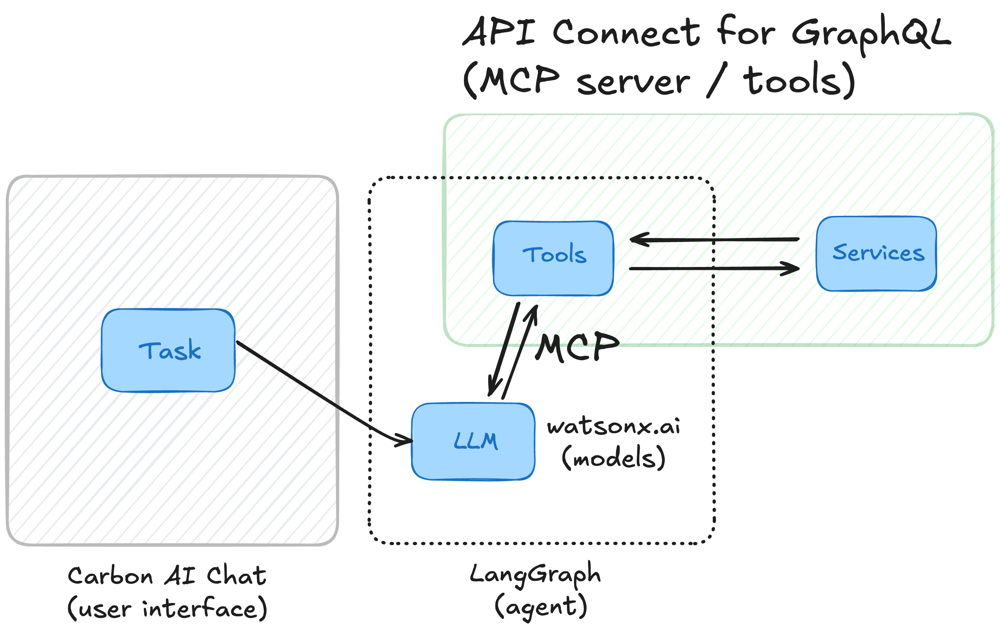

# Build a Chat Application with MCP (Model Context Protocol) using API Connect for GraphQL and watsonx.ai

> The functionality to build tools out of existing data sources such as APIs and Databases from `watsonx.ai Flows Engine / wxflows` is now part of API Connect for GraphQL (formerly StepZen). If you previously signed up for Flow Engine you don't have to sign up again, your existing login credentials and API Key remain valid.

Here's a step-by-step tutorial for setting up and deploying an AI Agent that leverages Model Context Protocol (MCP) for tools with [API Connect for GraphQL (formerly StepZen)](https://dashboard.ibm.stepzen.com/) and LangGraph, including installing necessary dependencies, deploying the app, and running it locally.



This example consists of the following pieces:

- LangGraph SDK (agent)
- watsonx.ai (models)
- API Connect For GraphQL (MCP server / tools)
- Carbon AI Chat (user interface)

> You can use any of the [supported chat models](https://js.langchain.com/docs/integrations/chat/).

This guide will walk you through installing the API Connect for GraphQL CLI, initializing and deploying a project, and running the application locally. We’ll use API Connect for GraphQL and deploy it as a MCP server, that has two tools: `google_books` and `wikipedia`.

## Before you start

Clone this repository and open the right directory:

```bash
git clone https://github.com/IBM/wxflows.git
cd examples/chat-app
```

## Step 1: Set up API Connect for GraphQL 

Before you can start building a MCP server using API Connect for GraphQL:

1. [Sign up](https://dashboard.ibm.stepzen.com/) for a free account.
2. [Download & install](https://www.ibm.com/docs/en/api-connect-graphql/saas?topic=setting-up-your-environment) the Node.js CLI:

    ```bash
    npm install -g stepzen
    ```

3. [Authenticate](https://wxflows.ibm.stepzen.com/docs/authentication) your account:

    ```bash
    stepzen login
    ```

> You can also [use API Connect for GraphQL locally](https://www.ibm.com/docs/en/api-connect-graphql/saas?topic=environment-using-docker-local-api-development) by using Docker.

## Step 2: Deploy a MCP server

Move into the `stepzen` directory:

```bash
cd stepzen
```

> API Connect for GraphQL was previously named StepZen, therefore some of the dependences still mention `stepzen`.

There's already a project for you set up this repository with the following values:

- **Defines an endpoint** `api/chat-app-example` for the project.
- **Imports `google_books` tool** with a description for searching books and specifying fields `books|book`.
- **Imports `wikipedia` tool** with a description for Wikipedia searches and specifying fields `search|page`.

You can deploy this tool configuration to a Flows Engine endpoint by running:

```bash
stepzen deploy
```

This command deploys the endpoint and tools defined as a MCP server.

## Step 3: Install Dependencies in the Application

To run the application you need to install the necessary dependencies:

```bash
cd ../
npm i
```

This command installs all required packages, including LangChain/LangGraph and any dependencies specified in the project.

## Step 4: Set Up Environment Variables

Copy the sample environment file to create your `.env` file:

```bash
cp .env.sample .env
```

Edit the `.env` file and add your credentials, such as API keys and other required environment variables. Ensure the credentials are correct to allow the tools to authenticate and interact with external services.

## Step 5: Run the Application

Finally, start the application by running:

```bash
npm run dev
```

This command initiates your application, allowing you to call and test the `google_books` and `wikipedia` tools through the MCP server.

## Summary

You’ve now successfully set up, deployed, and run a chat application that leverages API Connect for GraphQL as a MCP server with the `google_books` and `wikipedia` tools. This setup provides a flexible environment to leverage external tools for data retrieval, allowing you to further build and expand your application. See the instructions in [tools](../../tools/README.md) to add more tools or create your own tools from Databases, NoSQL, REST or GraphQL APIs.
